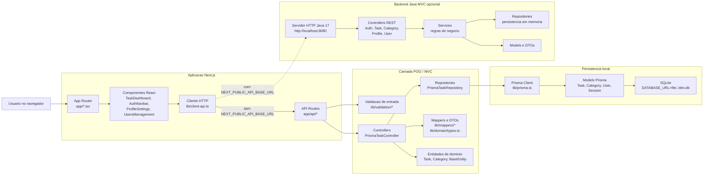

# IntelliTasks

Sistema de gestao de tarefas desenvolvido com Next.js, TypeScript, Tailwind CSS, Prisma e um backend Java MVC opcional no mesmo repositorio.

## Objetivo

O projeto representa uma TO-DO list com categorias, filtros, status e resumo de tarefas. A versao atual possui persistencia local com Prisma e SQLite, mantendo o projeto simples para testes e apresentacao sem depender de um servidor externo de banco de dados.

## Organizacao POO e MVC

- Model: classes `Task` e `Category`, alem dos models `Task` e `Category` no Prisma.
- View: componente `TaskDashboard`, responsavel pela interface do usuario.
- Controller: `PrismaTaskController`, responsavel por listar, criar, editar, excluir, filtrar e concluir tarefas.
- Repository: `PrismaTaskRepository`, responsavel pela persistencia dos dados via Prisma.
- API: rotas do Next em `app/api`, que conectam a View ao Controller.
- Backend Java: pasta `backend/`, com controllers, services, repositories e models em Java 17.

Conceitos de POO aplicados:

- Encapsulamento: entidades e repositorios concentram dados e regras em classes.
- Heranca: `Task` e `Category` herdam de `BaseEntity`.
- Polimorfismo: a regra foi separada por camadas, permitindo trocar a implementacao de persistencia sem reescrever a tela.

## Diagrama da arquitetura



## Funcionalidades

- Criar tarefas
- Editar tarefas
- Excluir tarefas
- Marcar como concluida ou reabrir
- Filtrar por categoria
- Filtrar por status
- Visualizar dashboard com total, pendentes, em andamento e concluidas
- Persistir dados em SQLite com Prisma

## Banco de dados

O projeto usa SQLite local para facilitar a execucao. A URL fica em `.env`:

```env
DATABASE_URL="file:./dev.db"
```

O arquivo `dev.db` e criado na raiz do projeto quando o comando de setup do banco e executado.

## Como instalar

```bash
npm install
```

## Como preparar o banco

Execute:

```bash
npm run db:setup
```

Esse comando faz tres coisas:

1. Gera o Prisma Client.
2. Cria/sincroniza o banco SQLite com o schema.
3. Insere categorias e tarefas iniciais.

Se quiser rodar cada etapa separadamente:

```bash
npm run db:generate
npm run db:push
npm run db:seed
```

## Como executar

```bash
npm run dev
```

Depois acesse:

```text
http://localhost:3000
```

## Como executar o backend Java MVC

O backend Java fica em `backend/` e usa apenas Java 17, sem Maven ou Gradle.

```bash
npm run dev:backend
```

Ele sobe em:

```text
http://localhost:8080
```

Para fazer os componentes client-side do Next chamarem o backend Java, adicione no `.env`:

```env
NEXT_PUBLIC_API_BASE_URL="http://localhost:8080"
```

Sem essa variavel, o frontend continua chamando as API Routes atuais do Next em `/api`.

## Como visualizar o banco

```bash
npm run db:studio
```

O Prisma Studio permite ver e editar as tabelas pelo navegador.

## Como testar o projeto

Na tela principal, valide:

- Criar uma nova tarefa e recarregar a pagina para confirmar que ela continua salva.
- Editar titulo, descricao, categoria, status e vencimento.
- Excluir uma tarefa.
- Marcar uma tarefa como concluida e reabrir.
- Filtrar por categoria.
- Filtrar por status.
- Conferir se os cards do dashboard atualizam.

Para validar o codigo:

```bash
npm run typecheck
npm run lint
npm run build
```
